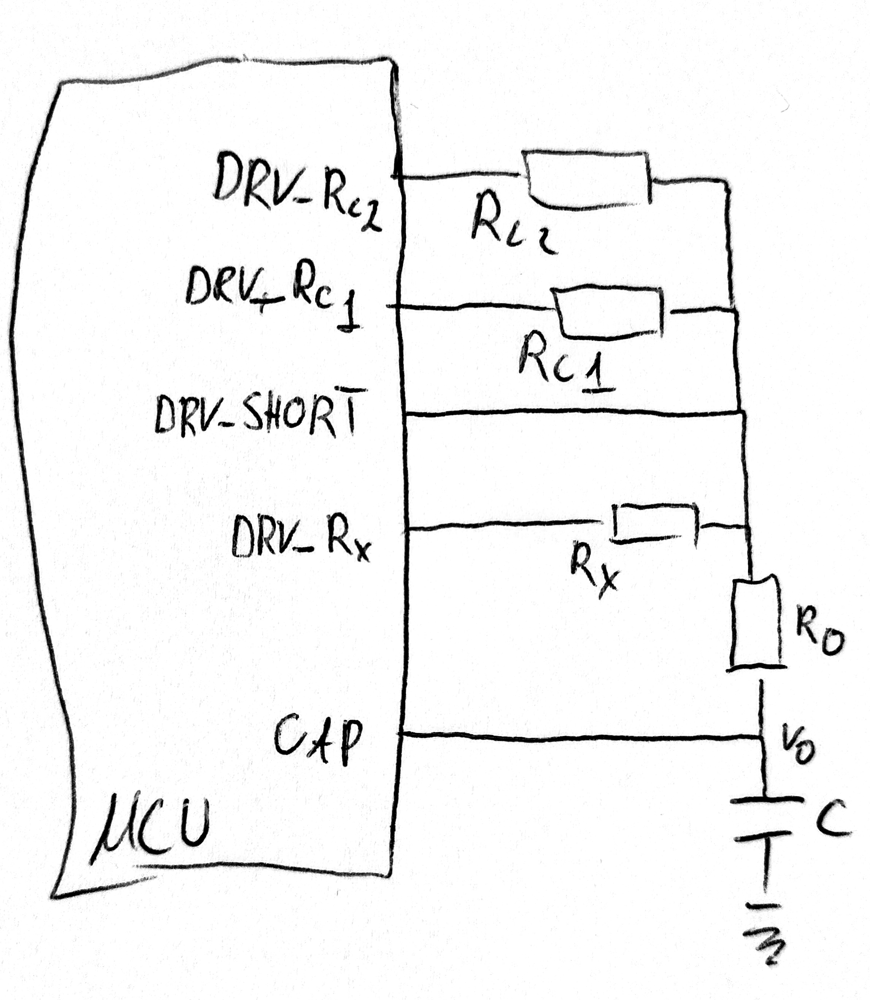

# Dokumentacja Koncepcyjna Projektu

**Temat pracy:** *Implementacja bezpośredniego interfejsu sensor-mikrokontroler dla czujników rezystancyjnych.*

## 1. Cel i Założenia Projektu

- **Główny cel:** Zbudowanie autorskiego stanowiska pomiarowego do przeprowadzenia metrologicznego porównania trzech algorytmów kalibracji układów DIC (1-, 2- i 3-punktowej).
- **Cel porównawczy:** Zbadanie wpływu architektury mikrokontrolera (8-bit AVR vs 32-bit ARM Cortex-M) oraz częstotliwości zegara referencyjnego ($T_{ref}$) na rozdzielczość TDC (Time-to-Digital Conversion), szum wyzwalania i błąd kwantyzacji.
- **Rzetelność badań:** Obydwa mikrokontrolery mierzą **ten sam pojedynczy tor pomiarowy**, a mikrokontroler nieaktywny jest galwanicznie odcinany kluczem analogowym i trzymany w stanie sprzętowego RESETu (stan *High-Z* na pinach I/O.

## 2. Metodologia i Algorytmy Kalibracji (RC-DIC)

Pomiar w układzie DIC polega na wyznaczeniu czasu rozładowania kondensatora $C$ przez badany rezystor do dolnego progu bufora Schmitta $V_{TL}$. Czas $T_d$ przeliczany jest na cykle timera $N_x$.

| Metoda Kalibracji | Wymagane Elementy Wzorcowe | Wzór Przeliczeniowy | Eliminowane Błędy i Zalety |
| :--- | :--- | :--- | :--- |
| **Jednopunktowa** | 1 rezystor wzorcowy $R_{c2}$ | $R_x = \frac{N_x}{N_{c2}} R_{c2}$ | Eliminuje zmiany pojemności $C$, napięcia $V_{cc}$, zegara $T_{ref}$ i progu $V_{TL}$. Zakłada brak offsetu. |
| **Dwupunktowa** | 2 rezystory wzorcowe $R_{c1}, R_{c2}$ | $R_x = R_{c1} + \frac{N_x - N_{c1}}{N_{c2} - N_{c1}}(R_{c2} - R_{c1})$ | Kompensuje stały błąd zerowy (offset), opóźnienia i liniową część rezystancji pinów $R_{OL}$. |
| **Trzypunktowa** | Rezystor $R_{c2}$ + Zwarcie + Rezystor prądowy $R_0$ | $R_x = \frac{N_x - N_{c1}}{N_{c2} - N_{c1}} R_{c2}$ | **Eliminuje wszystkie powyższe** + rezystancję wyjściową tranzystorów GPIO ($R_{OL}$) oraz opóźnienie programowe. Błąd $< 0.01\%$. |

> **Wniosek:** Układ do kalibracji 3-punktowej jest nadzbiorem pozostałych metod. Przełączając piny w kodzie programowym, na jednym fizycznym torze pomiarowym realizowane są wszystkie trzy algorytmy.

## 3. Architektura Sprzętowa

### 3.1. Tor Pomiarowy (5 Linii)

  

Tor pomiarowy składa się z 5 fizycznych ścieżek połączonych w jeden wspólny węzeł napięciowy $V_o$ przy kondensatorze $C$:
1. **Linia `CAP`:** Połączona bezpośrednio z kondensatorem $C$ i wejściem *Input Capture* timera.
2. **Linia `DRV_RX`:** Dołączona do badanego czujnika/rezystora $R_x$.
3. **Linia `DRV_RC1`:** Dołączona do dolnego rezystora wzorcowego $R_{c1}$ (np. $200\ \Omega$, 0.1%).
4. **Linia `DRV_RC2`:** Dołączona do górnego rezystora wzorcowego $R_{c2}$ (np. $10\text{ k}\Omega$, 0.1%).
5. **Linia `DRV_SHORT`:** Dołączona do ścieżki zwarciowej i szeregowego rezystora $R_0$ ograniczającego prądu pinu.

- **Kondensator $C$:** najlepiej typu C0G/NP0 (lub foliowy FKP/MKP) ze względu na niski współczynnik napięciowy i temperaturowy.
- **Gniazda testowe (footprint hybrydowy):** Pola lutownicze SMD połączone z otworami THT, w które wlutowane będą **złocone gniazda kołkowe (Machined Pins)**. Umożliwia to wygodną wymianę elementów $R_x, C, R_{c1}, R_{c2}, R_0$.

### 3.2. Mikrokontrolery Testowe
- **MCU A (8-bit AVR): ATmega328P-AU**
  - Zasilanie: $3.3\text{ V}$, Zegar: $8\text{ MHz}$ kwarcowy ($T_{ref} = 125\text{ ns}$).
  - Interfejs TDC: Sprzętowy moduł *Input Capture* na pinie `ICP1`.
- **MCU B (32-bit ARM): STM32L073RZ (LQFP-64)**
  - Zasilanie: $3.3\text{ V}$, Zegar: $32\text{ MHz}$ ($T_{ref} = 31.25\text{ ns}$).
  - Interfejs TDC: Timery 16-bit z modułem *Input Capture* i optymalizacją pod niski pobór energii (*Stop/Sleep Mode*).

### 3.3. Klucz Analogowy i Izolacja Sprzętowa
- **Scalony Przełącznik:** **TS3A27518E** (6-kanałowy przełącznik 1:2, $r_{on} \approx 4.4\ \Omega$).
  - Łączy 5 linii toru pomiarowego (`CAP`, `DRV_RX`, `DRV_RC1`, `DRV_RC2`, `DRV_SHORT`) albo z STM32, albo z ATmegą.
- **Hardware RESET Interlock (Gwarancja High-Z):**
  - Linie `RESET` obu mikrokontrolerów podciągnięte rezystorami $10\text{ k}\Omega$ do $+3.3\text{ V}$.
  - Połączone poprzez **diody Schottky'ego** z sygnałem sterującym z CP2105. Nieaktywny mikrokontroler jest trzymany w stanie sprzętowego RESETu, wymuszając stan wysokiej impedancji na wszystkich jego pinach I/O, bez blokowania linii programatora (SWD / ISP).

### 3.4. Zasilanie i Komunikacja USB
- **Zasilanie:** Pobierane z $V_{BUS}$ USB ($5\text{ V}$), stabilizowane przez niskoszumowy regulator LDO na **$3.3\text{ V}$** (np. `MCP1700-3302E` / `AP7361C`) z pojemnościami odsprzęgającymi $100\text{ nF} + 10\ \mu\text{F}$ przy każdym układzie scalonym.
- **Mostek USB:** **CP2105** (Silicon Labs, obudowa QFN-24):
  - **Kanał ECI UART:** Połączony z mikrokontrolerem STM32L073RZ.
  - **Kanał SCI UART:** Połączony z mikrokontrolerem ATmega328P.
  - **Pin GPIO.0_ECI:** Steruje sygnałem wyboru MUX (`IN1+IN2` w TS3A27518E) oraz sterowaniem linii RESET obu MCU przez diody.

## 4. Firmware i Pomiary

- **Strategia Pomiarów:**
  1. Mikrokontroler ładuje kondensator $C$ do $V_{cc}$.
  2. Wchodzi w tryb uśpienia, wyłączając zegary rdzenia cyfrowego w celu wyeliminowania zakłóceń prądowych i szumu na progu $V_{TL}$.
  3. Po zatrzaśnięciu timera przez moduł *Input Capture* wybudza się, zapisuje surową wartość ($N_x, N_{c1}, N_{c2}$) do bufora w pamięci.
  4. Po wykonaniu zadanej serii pomiarów (np. $K=100$) uruchamia UART i wysyła cały pakiet danych do PC.

## 5. Software PC

- **Architektura:** skrypt w Pythonie, który zarządza cała sekwencją pomiarową, zapisuje i przetwarza odebrane dane.
- **Automatyzacja pomiarów:** przy pomocy mostka CP2105 skrypt wybiera aktywny mikrokontroler i zleca mu pomiary, odbiera i zapisuje dane.
- **Przetwarzanie danych:** skrypt odbiera zawsze surowe dane i sam dokonuje obliczeń.