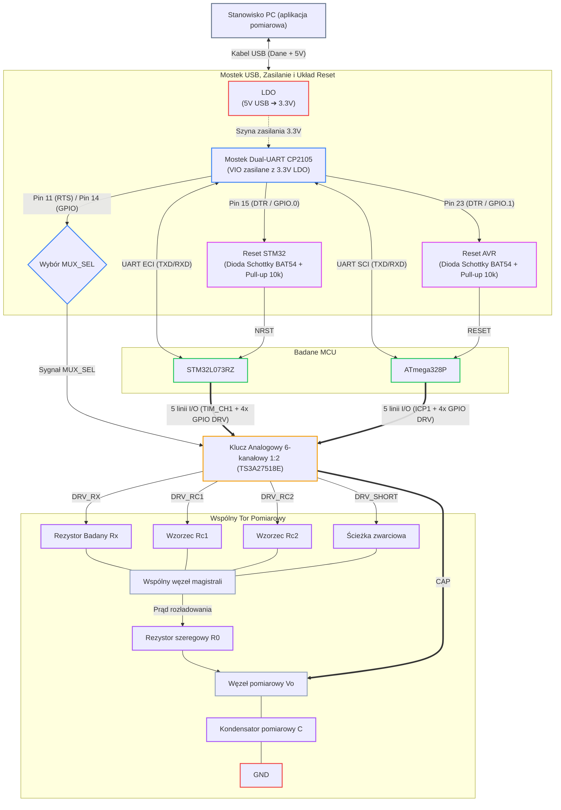

# Diagram blokowy

```mermaid
  flowchart TB
    subgraph InterfaceSection["Mostek USB, Zasilanie i Układ Reset"]
        LDO["LDO \n(5V USB ➔ 3.3V)"]:::pwrStyle
        CP2105["Mostek Dual-UART CP2105\n(VIO zasilane z 3.3V LDO)"]:::commStyle
        RST_STM["Reset STM32\n(Dioda Schottky BAT54 + Pull-up 10k)"]:::rstStyle
        RST_AVR["Reset AVR\n(Dioda Schottky BAT54 + Pull-up 10k)"]:::rstStyle
        MUX_JUMP{"Wybór MUX_SEL"}:::commStyle
    end

    subgraph MCUSection["Badane MCU"]
        STM32["STM32L073RZ"]:::mcuStyle
        AVR["ATmega328P"]:::mcuStyle
    end

    MUX["Klucz Analogowy 6-kanałowy 1:2 (TS3A27518E)"]:::muxStyle

    subgraph CircuitSection["Wspólny Tor Pomiarowy"]
        direction TB
        RX["Rezystor Badany Rx"]:::circuitStyle
        RC1["Wzorzec Rc1"]:::circuitStyle
        RC2["Wzorzec Rc2"]:::circuitStyle
        SHORT["Ścieżka zwarciowa"]:::circuitStyle

        SUM_NODE["Wspólny węzeł magistrali"]:::nodeStyle
        R0["Rezystor szeregowy R0"]:::circuitStyle
        VO_NODE["Węzeł pomiarowy Vo"]:::nodeStyle
        CAP_C["Kondensator pomiarowy C"]:::circuitStyle
        GND["GND"]:::pwrStyle
    end

    PC["Stanowisko PC (aplikacja pomiarowa)"]:::pcStyle
    PC <-->|"Kabel USB (Dane + 5V)"| InterfaceSection
    LDO -.->|"Szyna zasilania 3.3V"| CP2105
    
    CP2105 -->|"Pin 15 (DTR / GPIO.0)"| RST_STM
    CP2105 -->|"Pin 23 (DTR / GPIO.1)"| RST_AVR
    CP2105 -->|"Pin 11 (RTS) / Pin 14 (GPIO)"| MUX_JUMP

    CP2105 <-->|"UART ECI (TXD/RXD)"| STM32
    CP2105 <-->|"UART SCI (TXD/RXD)"| AVR

    RST_STM -->|"NRST"| STM32
    RST_AVR -->|"RESET"| AVR

    MUX_JUMP -->|"Sygnał MUX_SEL"| MUX
    STM32 ==>|"5 linii I/O (TIM_CH1 + 4x GPIO DRV)"| MUX
    AVR ==>|"5 linii I/O (ICP1 + 4x GPIO DRV)"| MUX

    RX --- SUM_NODE
    RC1 --- SUM_NODE
    RC2 --- SUM_NODE
    SHORT --- SUM_NODE

    SUM_NODE -->|"Prąd rozładowania"| R0
    R0 --> VO_NODE
    VO_NODE --- CAP_C
    CAP_C --- GND

    MUX -->|"DRV_RX"| RX
    MUX -->|"DRV_RC1"| RC1
    MUX -->|"DRV_RC2"| RC2
    MUX -->|"DRV_SHORT"| SHORT
    MUX ==>|"CAP"| VO_NODE

    classDef pcStyle stroke:#64748b,stroke-width:2px;
    classDef pwrStyle stroke:#ef4444,stroke-width:2px;
    classDef commStyle stroke:#3b82f6,stroke-width:2px;
    classDef rstStyle stroke:#d946ef,stroke-width:2px;
    classDef mcuStyle stroke:#22c55e,stroke-width:2px;
    classDef muxStyle stroke:#f59e0b,stroke-width:2px;
    classDef circuitStyle stroke:#a855f7,stroke-width:2px;
    classDef nodeStyle stroke:#94a3b8,stroke-width:2px;
```
