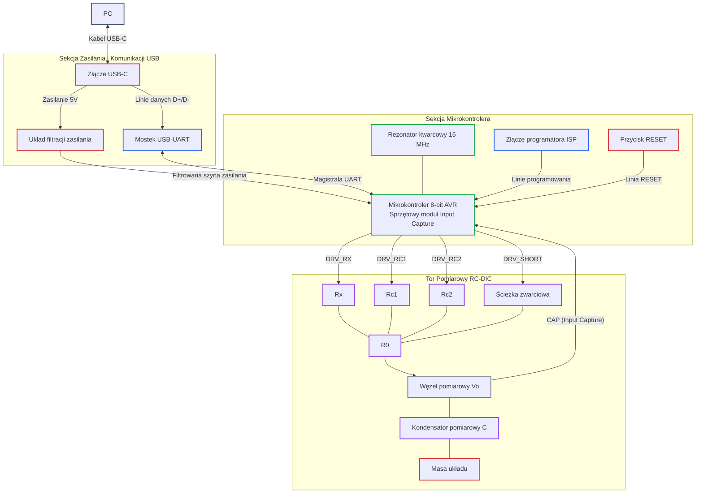

# Diagram blokowy

```mermaid
flowchart TB
    %% Definicje stylów
    classDef pcStyle stroke:#475569,stroke-width:2px;
    classDef pwrStyle stroke:#dc2626,stroke-width:2px;
    classDef commStyle stroke:#2563eb,stroke-width:2px;
    classDef mcuStyle stroke:#16a34a,stroke-width:2px;
    classDef circuitStyle stroke:#9333ea,stroke-width:2px;
    classDef nodeStyle stroke:#64748b,stroke-width:2px;

    %% Stanowisko nadrzędne
    PC["PC"]:::pcStyle

    %% Sekcja interfejsu USB i zasilania
    subgraph USBSection["Sekcja Zasilania i Komunikacji USB"]
        USBC["Złącze USB-C"]:::pwrStyle
        BRIDGE["Mostek USB-UART"]:::commStyle
        PWR_FILT["Układ filtracji zasilania"]:::pwrStyle
    end

    %% Sekcja mikrokontrolera
    subgraph MCUSection["Sekcja Mikrokontrolera"]
        MCU["Mikrokontroler 8-bit AVR\nSprzętowy moduł Input Capture"]:::mcuStyle
        XTAL["Rezonator kwarcowy 16 MHz"]:::mcuStyle
        ISP["Złącze programatora ISP"]:::commStyle
        RST_BLOCK["Przycisk RESET"]:::pwrStyle
    end

    %% Sekcja toru pomiarowego
    subgraph CircuitSection["Tor Pomiarowy RC-DIC"]
        direction TB
        RX["Rx"]:::circuitStyle
        RC1["Rc1"]:::circuitStyle
        RC2["Rc2"]:::circuitStyle
        SHORT["Ścieżka zwarciowa"]:::circuitStyle

        R0["R0"]:::circuitStyle
        VO_NODE["Węzeł pomiarowy Vo"]:::nodeStyle
        CAP_C["Kondensator pomiarowy C"]:::circuitStyle
        GND["Masa układu"]:::pwrStyle

        RX --- R0
        RC1 --- R0
        RC2 --- R0
        SHORT --- R0

        R0 --> VO_NODE
        VO_NODE --- CAP_C
        CAP_C --- GND
    end

    %% Połączenia nadrzędne i zasilanie
    PC <-->|"Kabel USB-C"| USBC
    USBC -->|"Linie danych D+/D-"| BRIDGE
    USBC -->|"Zasilanie 5V"| PWR_FILT
    PWR_FILT -->|"Filtrowana szyna zasilania"| MCU

    %% Połączenia cyfrowe i pomocnicze MCU
    BRIDGE <-->|"Magistrala UART"| MCU
    XTAL --- MCU
    ISP -->|"Linie programowania"| MCU
    RST_BLOCK -->|"Linia RESET"| MCU

    %% Linie toru pomiarowego DIC
    MCU -->|"DRV_RX"| RX
    MCU -->|"DRV_RC1"| RC1
    MCU -->|"DRV_RC2"| RC2
    MCU -->|"DRV_SHORT"| SHORT
    VO_NODE -->|"CAP (Input Capture)"| MCU

```
